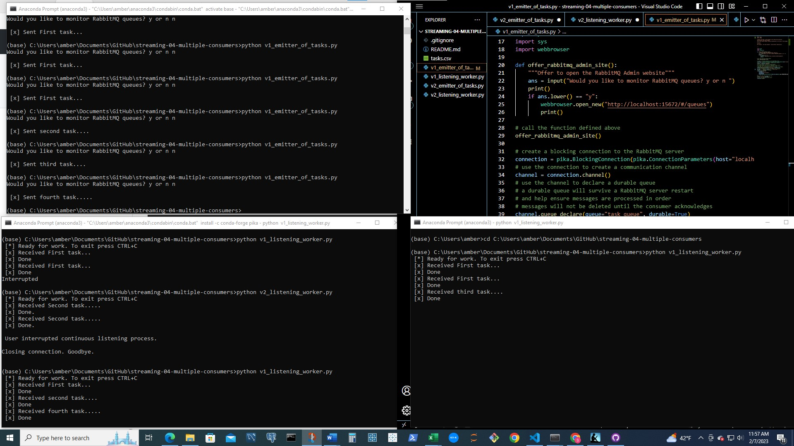
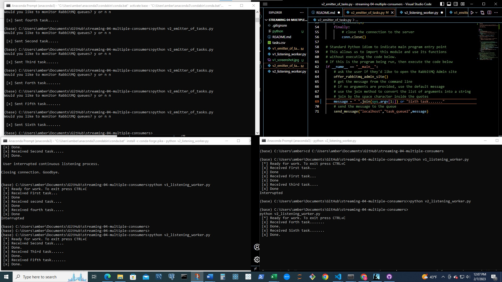
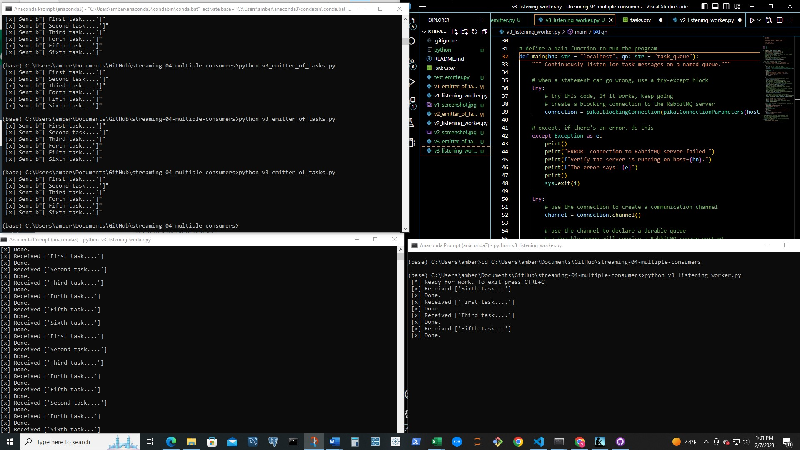

### Amber Speer
## Module 4 Assignment
## Feb 7, 2023

# streaming-04-multiple-consumers

> Use RabbitMQ to distribute tasks to multiple workers

One process will create task messages. Multiple worker processes will share the work. 

## Before You Begin

1. Fork this starter repo into your GitHub. (Done)
2. Clone your repo down to your machine.  (Done)
3. View / Command Palette - then Python: Select Interpreter  (Done)
4. Select your conda environment. (Done)

## Read

1. Read the [RabbitMQ Tutorial - Work Queues](https://www.rabbitmq.com/tutorials/tutorial-two-python.html)  (Done)
2. Read the code and comments in this repo.  (Done)

## RabbitMQ Admin 

RabbitMQ comes with an admin panel. When you run the task emitter, reply y to open it. (Done)

(Python makes it easy to open a web page - see the code to learn how.)

## Execute the Producer

1. Run emitter_of_tasks.py (say y to monitor RabbitMQ queues)

Explore the RabbitMQ website. (Done.  This only takes me to an error page that says localhost cannot be reached.)

## Execute a Consumer / Worker

1. Run listening_worker.py (Done)

Will it terminate on its own? How do you know? 
    No, it will not terminate on its own.  The code never tells it to terminate.

## Ready for Work

1. Use your emitter_of_tasks to produce more task messages.

# Screenshot of Version 1 emitter and listeners

## Start Another Listening Worker 

1. Use your listening_worker.py script to launch a second worker. 

Follow the tutorial. 
Add multiple tasks (e.g. First message, Second message, etc.)
How are tasks distributed? 
    The tasks go back and forth between the listeners
Monitor the windows with at least two workers. 
Which worker gets which tasks? They take turns.

# Screenshot of Version 2 emitter and listeners

# Screenshot of Version 3 emitter and listeners

## Reference

- [RabbitMQ Tutorial - Work Queues](https://www.rabbitmq.com/tutorials/tutorial-two-python.html)

## Screenshot

See a running example with at least 3 concurrent process windows here:
